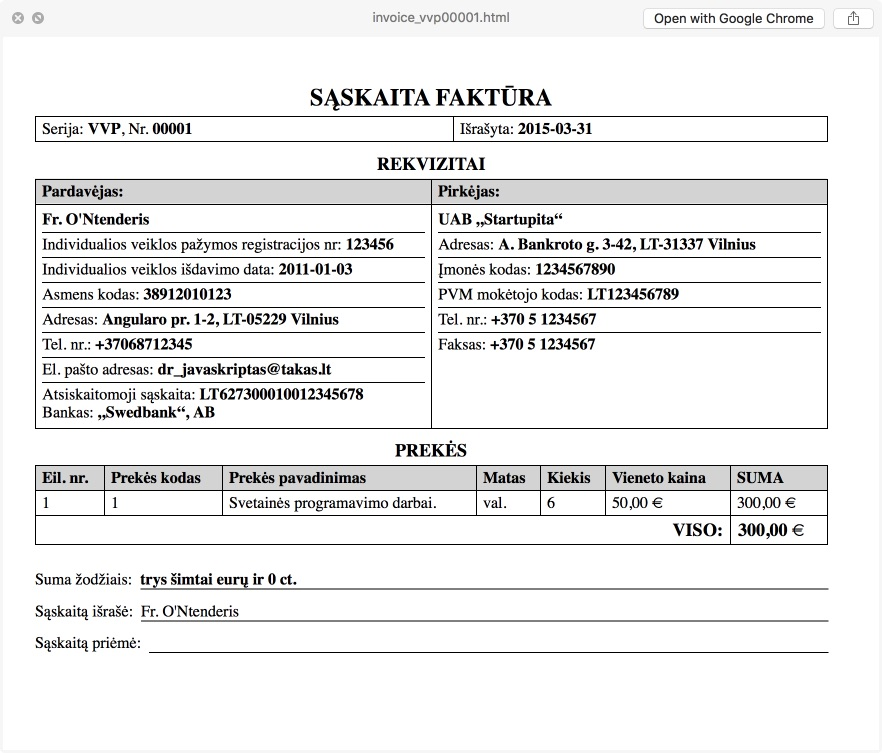
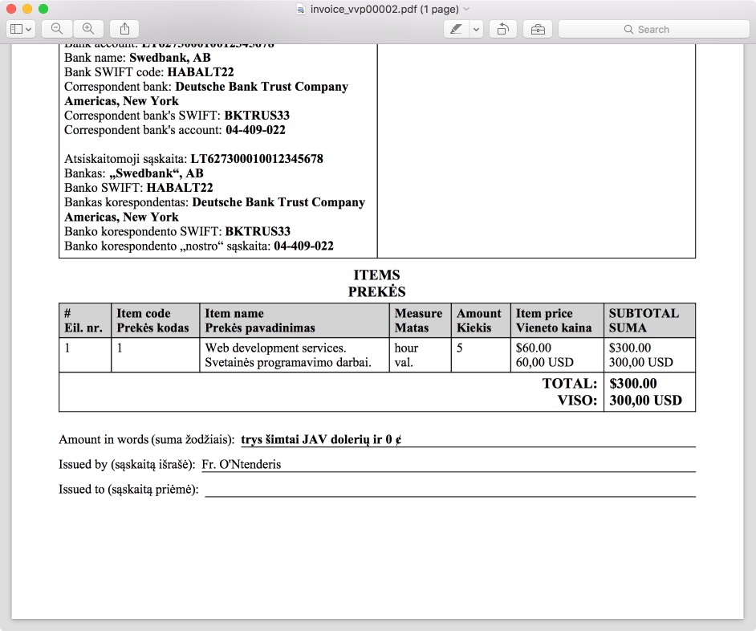
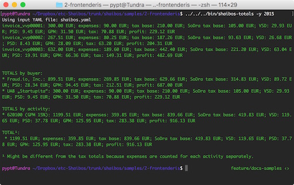
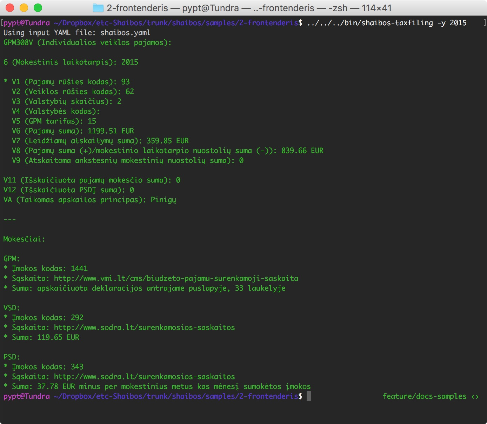

.. raw:: html

   <!-- pandoc -s README.mdown -o README.rst -->

shaibos
=======

|Build Status| |Coverage Status|

**shaibos** yra pajamų žurnalas, sąskaitų generatorius bei mokesčių
skaičiuoklė, skirta kompiuteristams, vykdantiems `individualią veiklą
pagal pažymą <https://www.vmi.lt/cms/web/kmdb/1.4.9>`__.

Paprastai tariant, jūs registruojate savo pajamas YAML faile, o
*shaibos* už jus sugeneruoja sąskaitas, suskaičiuoja kiek iš kokio
kliento uždirbote per metus, taip pat parašo, kiek, kam (VMI, SoDrai) ir
kokių mokesčių (GPM, PSD, VSD) reikia pervesti balandžio gale.

Savybės
-------

-  Neturi jokios duomenų bazės, nepasileidžia ant jokio porto –
   *shaibos* yra paprastas terminalo įrankis
-  Generuoja HTML / PDF sąskaitas kiekvienai individualios veiklos
   rūšiai
-  Pagal kiekvienos kalbos reikalavimus formatuoja skaičius, nurodančius
   sumas
-  Sąskaitose automatiškai įrašo mokėtiną sumą žodžiais
-  Palaiko sąskaitas keliomis kalbomis
-  Leidžia sekti, kurios sąskaitos buvo apmokėtos
-  Skaičiuoja pajamų, pelno bei mokesčių sumas – bendrą, pagal klientą
   arba pagal veiklos rūšį
-  Parašo, ką įrašyti į VMI pajamų deklaraciją
-  Apskaičiuoja, kiek pinigų pervesti VMI ir SoDrai pagal reikiamus
   įmokos kodus
-  Automatiškai konvertuoja valiutas pagal Lietuvos banko oficialų
   dienos kursą
-  Teisingai suapvalina atskirus mokesčių sumos komponentus
-  Palaiko įvairius VSD tarifus (28,5% nekaupiantiems papildomos
   pensijos, 29,5%-30,5% kaupiantiems)
-  Laiko duomenis paprastame YAML faile; jeigu *shaibos* nepatiks,
   galite imti ir išsikelti savo buhalteriją kitur

Įdiegimas
---------

Įdiekite *shaibos*:

::

    pip install git+https://github.com/pypt/shaibos.git

Įrankiai
--------

``shaibos-html`` – HTML sąskaitų generavimas
~~~~~~~~~~~~~~~~~~~~~~~~~~~~~~~~~~~~~~~~~~~~

Naudojimas:

::

    shaibos-html

arba:

::

    shaibos-html --input_yaml shaibos.yaml \
                 --template shaibos/templates/basic.jinja2 \
                 --output_dir invoices/html/

Sugeneruoja visas sąskaitas iš YAML failo HTML formatu.

``shaibos-pdf`` – PDF sąskaitų generavimas
~~~~~~~~~~~~~~~~~~~~~~~~~~~~~~~~~~~~~~~~~~

Naudojimas:

::

    shaibos-pdf

arba:

::

    shaibos-pdf --input_yaml shaibos.yaml \
                --template shaibos/templates/basic.jinja2 \
                --output_dir invoices/pdf/

Sugeneruoja visas sąskaitas iš YAML failo PDF formatu.

``shaibos-totals`` – per metus išrašytų sąskaitų suvestinė
~~~~~~~~~~~~~~~~~~~~~~~~~~~~~~~~~~~~~~~~~~~~~~~~~~~~~~~~~~

Naudojimas:

::

    shaibos-totals -y 2015

arba:

::

    shaibos-totals --input_yaml saskaitos.yaml --year 2015

Suskaičiuoja ir išveda nurodytais metais apmokėtų sąskaitų suvestines
pagal klientą ir veiklos rūšį, taip pat bendrą uždirbtų pinigų sumą.

``shaibos-taxfiling`` – VMI deklaruojamų pajamų ir mokesčių skaičiuoklė
~~~~~~~~~~~~~~~~~~~~~~~~~~~~~~~~~~~~~~~~~~~~~~~~~~~~~~~~~~~~~~~~~~~~~~~

Naudojimas:

::

    shaibos-taxfiling -y 2015

arba:

::

    shaibos-taxfiling --input_yaml saskaitos.yaml --year 2015

Parašo, ką rašyti į kiekvieną GPM308 deklaracijos "V"" priedo
("Individualios veiklos pajamos") langelį, taip pat apskaičiuoja
galutinius mokesčius, kuriuos reikia pervesti VMI ir SoDrai.

Pajamų failas ``shaibos.yaml``
------------------------------

Per metus iš individualios veiklos gautos pajamos surašomos YAML formatu
į vieną failą.

Kompiuteristai, jų poreikiai bei kantrybė yra skirtingi, todėl
pateikiame tris šio pajamų failo pavyzdžius:

Viena veikla Lietuvos ribose
~~~~~~~~~~~~~~~~~~~~~~~~~~~~

Iliustruojama nesudėtinga pajamų struktūra:
vykdoma tik viena veikla, yra du klientai Lietuvoje, sąskaitos išrašomos vietine valiuta.

shaibos.yaml`` pavyzdys:
`shaibos/samples/1-lt-simple/shaibos.yaml <shaibos/samples/1-lt-simple/shaibos.yaml>`__

Kelios veiklos Lietuvos ribose
~~~~~~~~~~~~~~~~~~~~~~~~~~~~~~

Iliustruojamas atvejį, kai yra kelios veiklos Lietuvoje.

``shaibos.yaml`` pavyzdys:
`shaibos/samples/2-lt-multiple-activities/shaibos.yaml <shaibos/samples/2-lt-multiple-activities/shaibos.yaml>`__

Veikla už Lietuvos ribų
~~~~~~~~~~~~~~~~~~~~~~

Iliustruojamas sudėtingesnis atvejis, kuomet sąskaitos išrašomos keliomis kalbomis ir užsienio valiuta.

``shaibos.yaml`` pavyzdys:
`shaibos/samples/3-multiple-countries/shaibos.yaml <shaibos/samples/3-multiple-countries/shaibos.yaml>`__

To-Do
-----

-  Pridėti `PVM
   ribos <https://www.vmi.lt/cms/pridetines-vertes-mokestis>`__
   palaikymą
-  Pridėti `individualios veiklos pajamų
   "lubų" <http://www.veiklosmokesciai.lt/apie-individualia-veikla/individualios-veiklos-mokesciai/>`__
   palaikymą
-  Pridėti galimybę sekti per metus sumokėtą PSD
-  Pridėti galimybę siųsti sugeneruotas sąskaitas paštu
-  Sugalvoti geresnių bajerių

Garantijos
----------

Nėra jokių garantijų, seni. Nors ir stengiausi, kad programa veiktų
teisingai (nes pats ją naudoju), bet jeigu ką nors ne taip suskaičiuosi
ir deklaruosi, pats kaltas.

.. |Build Status| image:: https://travis-ci.org/pypt/shaibos.svg?branch=develop
   :target: https://travis-ci.org/pypt/shaibos
.. |Coverage Status| image:: https://coveralls.io/repos/github/pypt/shaibos/badge.svg?branch=develop
   :target: https://coveralls.io/github/pypt/shaibos
